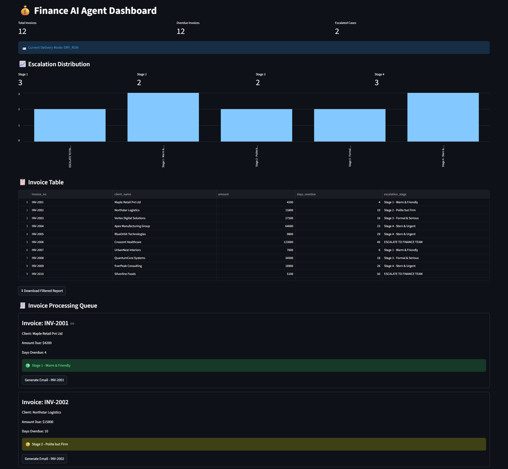

# 💰 Finance AI Agent Dashboard

An AI-powered finance workflow automation system built using Python, Streamlit, and Llama 3 to automate overdue invoice follow-ups, generate escalation-aware payment reminder emails, and maintain operational audit logs.

The project simulates how modern finance teams can use AI agents to automate repetitive collections workflows while maintaining controlled escalation behavior, traceability, and operational safety.

---

# 🚀 Project Overview

Managing overdue invoices manually is repetitive, inconsistent, and difficult to scale efficiently. Finance teams often spend significant operational effort:
- tracking unpaid invoices,
- calculating overdue durations,
- drafting reminder emails,
- escalating unresolved cases, and
- maintaining communication records.

This project demonstrates how AI agents can automate these workflows using:
- rule-based escalation logic,
- LLM-powered email generation,
- workflow automation,
- dashboard monitoring, and
- audit logging.

The system acts as a lightweight finance operations assistant capable of autonomously generating contextual payment reminders with progressively escalating tone and urgency.

---

# 🎯 Key Capabilities

- Autonomous overdue invoice analysis
- Dynamic escalation stage assignment
- AI-generated contextual reminder emails
- SMTP + dry-run delivery modes
- Audit logging and traceability
- Streamlit operational dashboard
- Scheduler-ready workflow automation
- Security-conscious architecture

---

# ✨ Features

- AI-generated invoice reminder emails
- Automated escalation stage detection
- Progressive tone escalation logic
- Interactive Streamlit dashboard
- Escalation analytics and metrics
- Audit logging system
- DRY_RUN safe testing mode
- Real SMTP email integration
- Modular Python architecture
- Scheduler-ready automation workflow

---

# 🛠 Tech Stack

| Component | Technology |
|---|---|
| Frontend Dashboard | Streamlit |
| Backend Logic | Python |
| Data Processing | Pandas |
| AI Email Generation | Llama 3 via Ollama |
| Scheduling | APScheduler |
| Validation | Pydantic |
| Logging | JSONL |
| Data Storage | CSV |

---

# 🧠 LLM Choice: Llama 3 (Local Inference via Ollama)

The project uses Meta’s Llama 3 model running locally through Ollama.

This approach was selected because:

- Eliminates cloud API costs during development
- Improves privacy by keeping invoice data local
- Enables unrestricted experimentation
- Provides strong instruction-following performance
- Avoids external API dependency issues

The model is responsible for generating escalation-aware finance reminder emails with progressively changing tone and urgency.

## Escalation Progression

| Stage | Tone |
|---|---|
| Stage 1 | Warm & Friendly |
| Stage 2 | Polite but Firm |
| Stage 3 | Formal & Serious |
| Stage 4 | Stern & Urgent |

---

# 🏗 Agent Architecture

```text
                    +------------------+
                    |   invoices.csv   |
                    +------------------+
                              |
                              v
                  +----------------------+
                  |   Data Loader        |
                  |  (Pandas Processing) |
                  +----------------------+
                              |
                              v
                 +-----------------------+
                 | Escalation Engine     |
                 | determine_stage()     |
                 +-----------------------+
                              |
                              v
                +-------------------------+
                | Finance AI Agent        |
                | Email Generator (LLM)   |
                +-------------------------+
                              |
                              v
                  +----------------------+
                  |   Validation Layer   |
                  +----------------------+
                              |
                              v
                  +----------------------+
                  |   Dispatcher Layer   |
                  +----------------------+
                     |              |
                     v              v
             +-------------+   +-------------+
             |   DRY_RUN   |   | SMTP Sender |
             +-------------+   +-------------+
                     |              |
                     +------+-------+
                            |
                            v
                  +----------------------+
                  |    Audit Logger      |
                  +----------------------+
                            |
                            v
                  +----------------------+
                  |  Streamlit Dashboard |
                  +----------------------+

---
```
# 📬 Delivery Modes

The system supports two delivery configurations:

| Mode | Description |
|---|---|
| DRY_RUN | Simulates sending emails safely during testing |
| SMTP | Sends real emails using Gmail SMTP integration |

This architecture enables safe experimentation while supporting real workflow execution.

---

# 🔐 Security Mitigations

Although this is a portfolio/demo application, several security practices were considered.

## 1. Environment Variable Protection

API keys are stored using `.env` files instead of hardcoding secrets in source code.

Example:

```env
OPENAI_API_KEY=your_api_key_here
```

The `.env` file is excluded using `.gitignore`.

---

## 2. Mock Email Sending

The project uses mock email delivery instead of real SMTP integration to prevent accidental email transmission during testing.

This avoids:
- Spam risks
- Accidental client communication
- Credential exposure

---

## 3. Input Validation

Invoice data is processed through structured Pandas workflows to reduce malformed data issues.

Datetime conversion is validated before overdue calculations.

---

## 4. Audit Logging

Actions are logged into JSONL audit files to maintain traceability of:
- Generated emails
- Escalation stages
- Delivery activity

This supports operational transparency.

---

## 5. Separation of Concerns

The project separates:
- business logic
- AI generation
- logging
- UI rendering
- configuration

This reduces security and maintenance risks caused by tightly coupled code.

---
# 💡 Why This Project Matters

Finance teams spend significant operational effort following up on overdue payments manually. This project demonstrates how AI agents can automate repetitive collections workflows while maintaining controlled escalation logic, auditability, and operational safety.

The focus of the system is not only AI text generation, but also:
- workflow orchestration,
- observability,
- validation,
- safe automation design, and
- human-in-the-loop escalation control.
---

# 📂 Project Structure

```text
finance-ai-agent/
│
├── app/
│   ├── config.py
│   ├── data_loader.py
│   ├── dispatcher.py
│   ├── email_generator.py
│   ├── escalation_engine.py
│   ├── logger.py
│   ├── real_sender.py
│   ├── scheduler.py
│   └── sender.py
│
├── data/
│   └── invoices.csv
│
├── logs/
│   └── audit_log.jsonl
│
├── dashboard.py
├── main.py
├── requirements.txt
├── README.md
└── .gitignore
```

---

# ⚙️ Setup Instructions

## 1. Clone Repository

```bash
git clone <your-repo-url>
```

Move into the project folder:

```bash
cd finance-ai-agent
```

---

## 2. Create Virtual Environment

### Windows

```bash
python -m venv venv
venv\Scripts\activate
```

### Mac/Linux

```bash
python3 -m venv venv
source venv/bin/activate
```

---

## 3. Install Dependencies

```bash
pip install -r requirements.txt
```

---

## 4. Install Ollama

Download and install Ollama:

```env
ollama run llama3
```

---

## 5. Configure Environment Variables

Create a `.env` file:

```env
SEND_MODE=DRY_RUN

EMAIL_ADDRESS=your_email@gmail.com
EMAIL_APP_PASSWORD=your_app_password
```

---

## 6. Run the Application

```bash
streamlit run dashboard.py
```

Open in browser:

```text
http://localhost:8501
```

---

# 📊 Dashboard Features

## Invoice Monitoring
- Track overdue invoices
- Monitor escalation stages
- Identify critical finance cases

## AI Email Generation
- Generate contextual reminder emails
- Escalation-aware tone generation
- Mock delivery simulation

## Analytics
- Escalation distribution charts
- Invoice metrics
- Search and filtering

## Audit Logs
- Track generated communications
- Store delivery activity
- Maintain operational history

---

# 📸 Screenshots



---
# ✉️ Sample Generated Emails

---

## Stage 1 — Warm & Friendly

**Subject:** Quick Reminder – Invoice INV-2001

Hi Maple Retail Pvt Ltd,

Just a friendly reminder that invoice INV-2001 for $4,200 is now 3 days overdue. The original due date was May 10, 2026.

If you have already processed the payment, please disregard this message. Otherwise, you can complete the payment using the provided payment link.

Thank you for your prompt attention.

---

## Stage 4 — Stern & Urgent

**Subject:** FINAL NOTICE – Invoice INV-2005 – Immediate Action Required

Dear BlueOrbit Technologies,

This is your final reminder regarding invoice INV-2005 for $9,800, which is now 28 days overdue.

Despite previous follow-ups, payment remains pending. Failure to settle the outstanding balance within the next 24 hours may result in escalation to our finance and recovery team for further action.

Please process the payment immediately or contact us with a resolution plan to avoid escalation.

---

# 🔮 Future Improvements

- Real email delivery integration
- ML-based payment risk prediction
- Database integration
- Multi-user authentication
- Docker deployment
- Role-based access control
- Payment history analytics

---

# 🧠 Learning Outcomes

This project demonstrates:

- AI-powered workflow automation
- Streamlit dashboard engineering
- LLM integration in business systems
- Data processing with Pandas
- Modular backend architecture
- Logging and audit systems
- Internal tool development

---

# 📜 License

This project is intended for educational and portfolio purposes.
